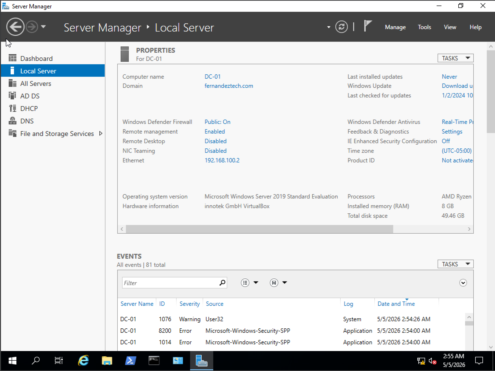
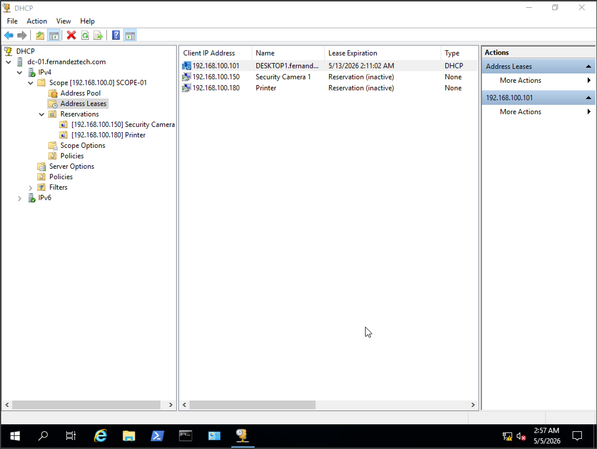
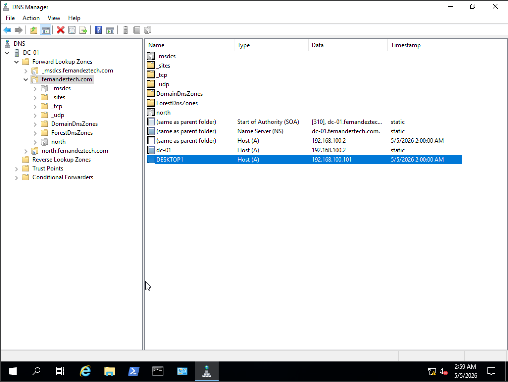
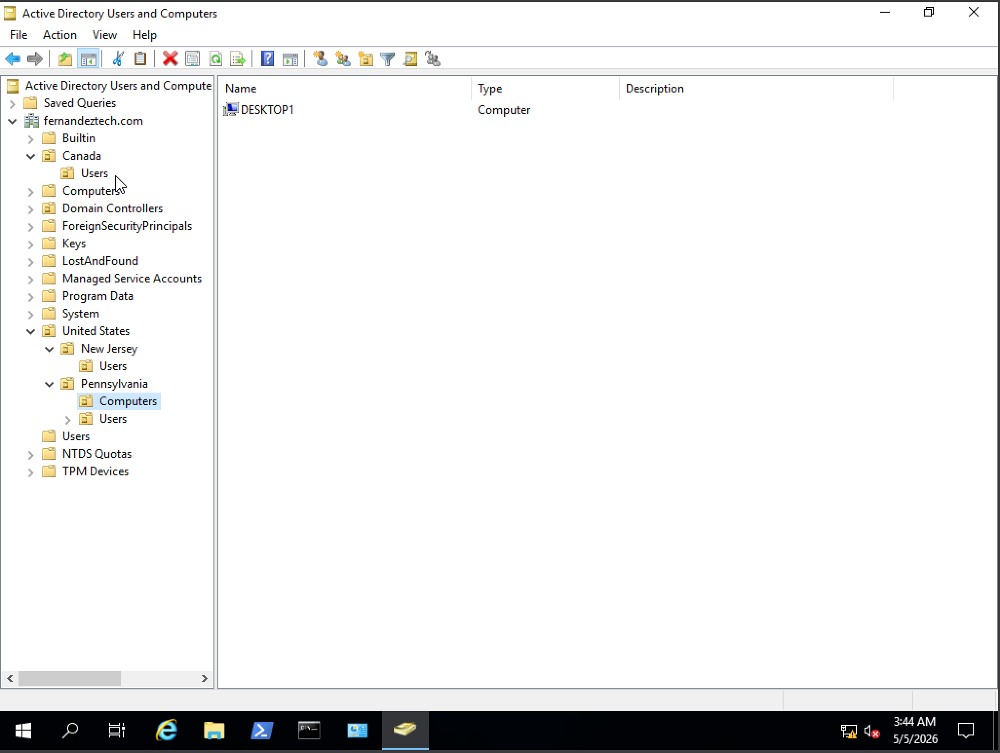
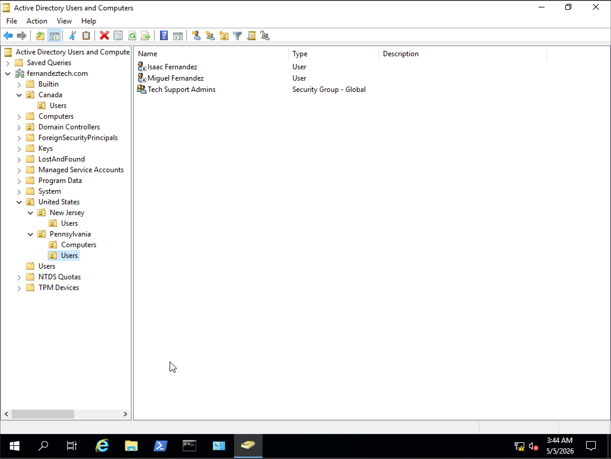
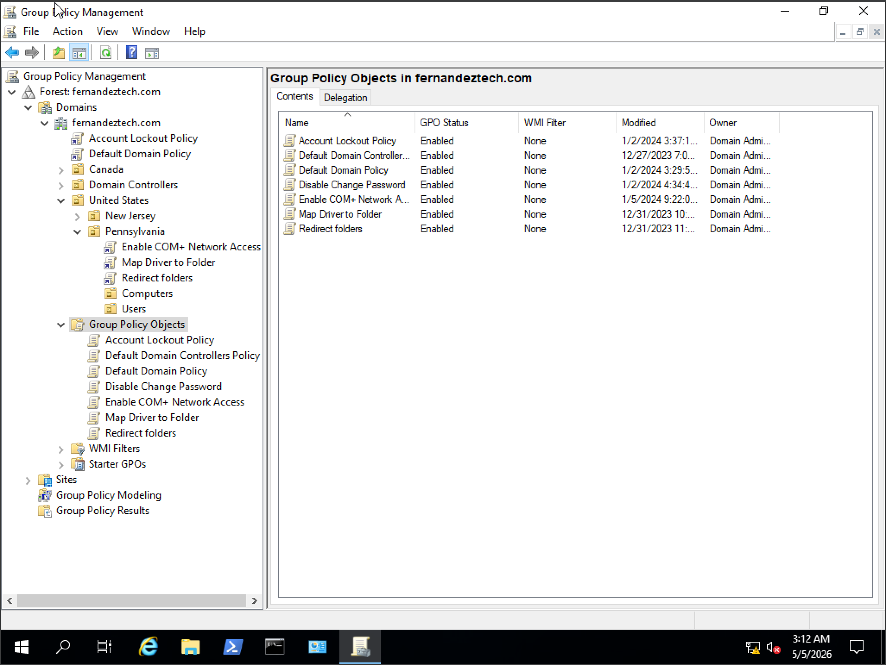
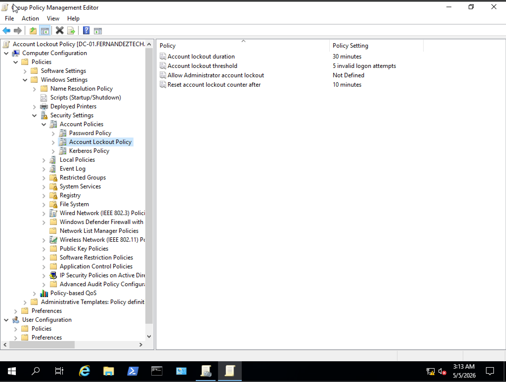

# Active Directory Home Lab

## Overview
Built a fully functional Active Directory environment using virtual machines to simulate a small business network. This lab demonstrates hands-on experience with domain services, identity management, and core network infrastructure.

## Skills Demonstrated
- Active Directory Domain Services (AD DS)
- DHCP & DNS configuration
- User and group management
- Organizational Unit (OU) design
- Group Policy (GPO) configuration
- Windows Server administration
- Troubleshooting domain environments

## Envirnment Setup
- Server OS: Windows Server 2019
- Client OS: Windows 10
- Virtualization: VirtualBox
- Network: Internal virtual network

## Screenshots

## What I Learned
This project strengthened my understanding of how enterprise environments manage users, devices, and policies centrally, and improved my ability to troubleshoot real-world domain issues.
